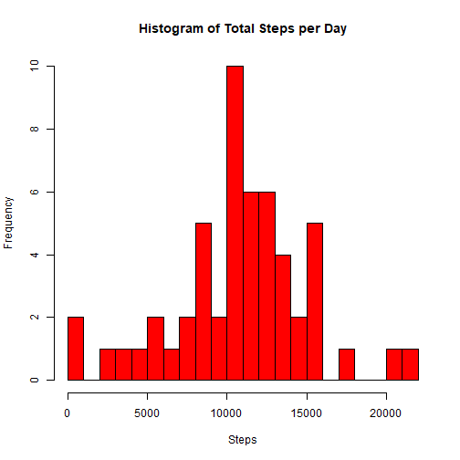
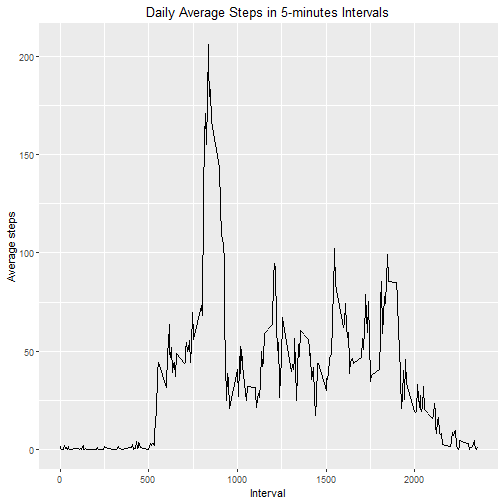
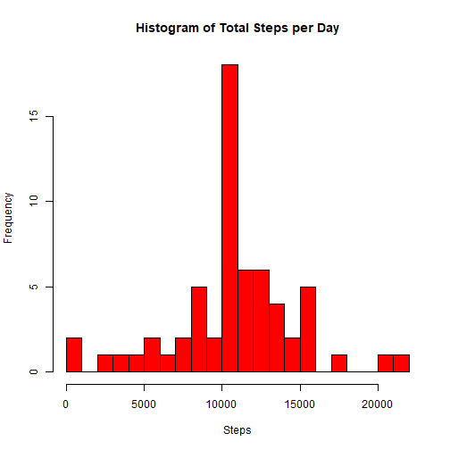
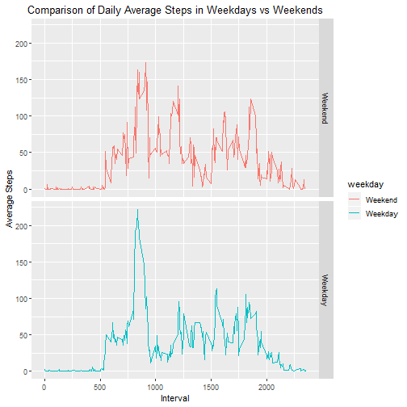

## Reproducible research week2 project

### 1. Load file

read the activity dataset and check data structure


```r
activity <- read.csv("activity.csv")
head(activity)
```

```
##   steps       date interval
## 1    NA 2012-10-01        0
## 2    NA 2012-10-01        5
## 3    NA 2012-10-01       10
## 4    NA 2012-10-01       15
## 5    NA 2012-10-01       20
## 6    NA 2012-10-01       25
```

```r
str(activity)
```

```
## 'data.frame':	17568 obs. of  3 variables:
##  $ steps   : int  NA NA NA NA NA NA NA NA NA NA ...
##  $ date    : Factor w/ 61 levels "2012-10-01","2012-10-02",..: 1 1 1 1 1 1 1 1 1 1 ...
##  $ interval: int  0 5 10 15 20 25 30 35 40 45 ...
```

### 2.Histogram of the total number of steps taken everyday

calculate the sum of steps grouped by date, and plot the histogram


```r
library(dplyr)
```

```
## 
## Attaching package: 'dplyr'
```

```
## The following objects are masked from 'package:stats':
## 
##     filter, lag
```

```
## The following objects are masked from 'package:base':
## 
##     intersect, setdiff, setequal, union
```

```r
library(tidyr)
grp <- group_by(activity,date)
total <- summarize(grp,sum=sum(steps))%>%
        rename(steps="sum")
total <- filter(total,!is.na(steps)==TRUE)
hist(total$steps,col="red",breaks=20, main ="Histogram of Total Steps per Day", xlab="Steps", ylab="Frequency")
```



### 3.List the mean and median of steps taken daily

Calculate the mean of daily taken steps


```r
mean(total$steps)
```

```
## [1] 10766.19
```

Calculate the median of steps taken daily


```r
median(total$steps)
```

```
## [1] 10765
```

### 4.Time series plot of the average of steps 

subset the dataset by selecting steps and interval columns, calculate the mean based on groups of interval, and plot the mean of steps in 5-minutes interval across examined days using ggplot2 package

```r
library(ggplot2)
```

```
## Need help? Try Stackoverflow:
## https://stackoverflow.com/tags/ggplot2.
```

```r
datainterval <- activity %>%
        select(steps,interval)%>%
        filter(!is.na(steps)==TRUE)%>%
        group_by(interval)%>%
        summarize(mean=mean(steps))

ggplot(datainterval,aes(interval,mean)) +
        geom_line()+
        xlab("Interval")+
        ylab("Average steps")+
        ggtitle("Daily Average Steps in 5-minutes Intervals") +
        theme(plot.title = element_text(hjust = 0.5))
```



###5. List the maximum value of average steps in 5-minutes intervals across months


```r
max<- which(datainterval$mean==max(datainterval$mean))
datainterval[max,]
```

```
## # A tibble: 1 x 2
##   interval  mean
##      <int> <dbl>
## 1      835  206.
```

###6. Code to describe the missing value

the total number of rows having NA values 

```r
sum(is.na(activity$steps))
```

```
## [1] 2304
```

###7. Histogram of total number of steps after imputing missing values

impute missing values by filling in NAs with the mean of corresponding interval and re-plot the histogram

```r
replacewithmean <- function(x) replace(x, is.na(x), mean(x, na.rm = TRUE))
activitysub <- activity %>% 
         group_by(interval)%>%
        mutate(steps=replacewithmean(steps))%>%
        group_by(date)
sub_total <- summarize(activitysub,sum=sum(steps)) %>%
        rename(tsteps="sum")

hist(sub_total$tsteps,col="red",breaks=20, main ="Histogram of Total Steps per Day", xlab="Steps", ylab="Frequency")
```



calculate the mean of the new dataset

```r
mean(sub_total$tsteps)
```

```
## [1] 10766.19
```

culculate the median of the new dataset

```r
median(sub_total$tsteps)
```

```
## [1] 10766.19
```

compare the difference between old data containing NAs and new data that is imputed (join the two datasets together using full_join command in dplyr and compare the summary)


```r
comp <- full_join(total,sub_total)%>%
        rename(steps_old="steps",steps_new="tsteps")
```

```
## Joining, by = "date"
```

```r
summary(comp)
```

```
##          date      steps_old       steps_new    
##  2012-10-01: 1   Min.   :   41   Min.   :   41  
##  2012-10-02: 1   1st Qu.: 8841   1st Qu.: 9819  
##  2012-10-03: 1   Median :10765   Median :10766  
##  2012-10-04: 1   Mean   :10766   Mean   :10766  
##  2012-10-05: 1   3rd Qu.:13294   3rd Qu.:12811  
##  2012-10-06: 1   Max.   :21194   Max.   :21194  
##  (Other)   :55   NA's   :8
```

###8.Compare average steps in 5-miniutes intervals between weekdays and weekends

Use lubridate package to convert date into weekday.For instance, 1 is Saturday, 2 is Sunday and so on. Replace the numbers with the catogory variable (Weekday and Weekend). Calculate and plot the mean of steps grouped by the weekday or weekend catogories 

```r
library(lubridate)
```

```
## 
## Attaching package: 'lubridate'
```

```
## The following object is masked from 'package:base':
## 
##     date
```

```r
activity$weekday <- wday(activity$date) 
activity$weekday <- as.factor(activity$weekday)
activity$weekday <- recode(activity$weekday,"1"="Weekend","2"="Weekend") 
activity$weekday <- recode(activity$weekday,"3"="Weekday","4"="Weekday","5"="Weekday","6"="Weekday","7"="Weekday") 
        
sum_day <- activity %>%
        filter(!is.na(steps)==TRUE)%>%
        group_by(weekday,interval)%>%
        summarize(mean=mean(steps))

ggplot(sum_day,aes(interval,mean)) +
        geom_line(aes(col=weekday))+
        facet_grid(weekday~.) +
        xlab("Interval") +
        ylab("Average Steps") +
        ggtitle("Comparison of Daily Average Steps in Weekdays vs Weekends") +
        theme(plot.title = element_text(hjust = 0.5))
```


